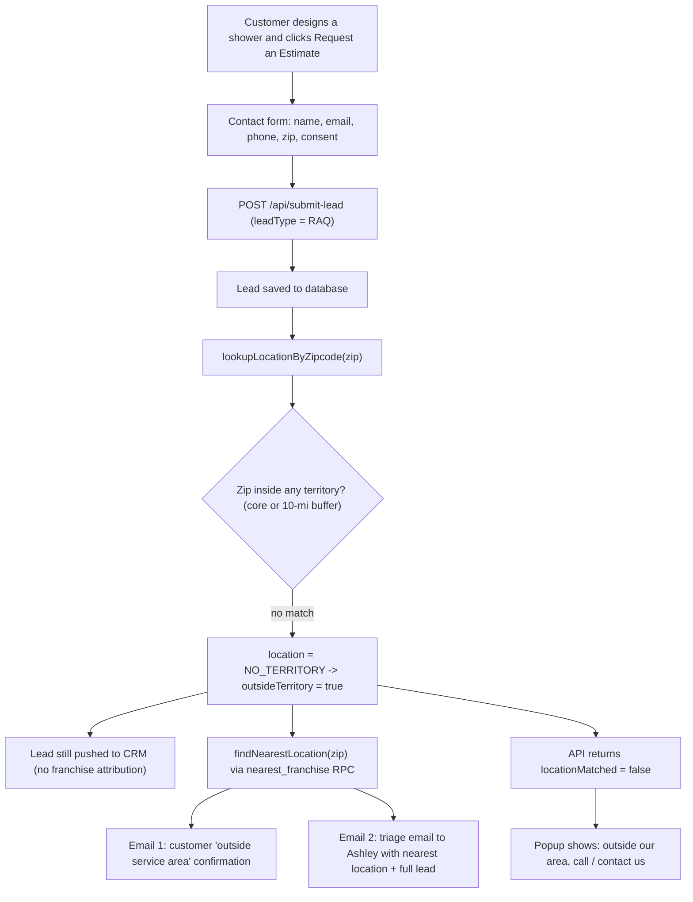

# Quote Requests Outside Our Service Area

What happens when a customer requests a quote (RAQ) from the Gatsby Glass
Visualizer but their zip code is **not** covered by any franchise territory —
even after each territory is expanded by the configurable mileage buffer
(Vault secret `territory_radius_miles`, default 10 miles).

The short version: **the lead is never lost.** It is still saved and pushed to
the CRM, the customer gets a friendly "we don't cover your area yet" email with
how to reach us, and a triage notification (with the full lead details and the
single closest location) is sent to Ashley so it can be forwarded if a nearby
location is willing to service it.

## Files in this folder

| File | What it is |
| ---- | ---------- |
| `email-1-customer-outside-service-area.html` | The email the **customer** receives |
| `email-2-franchise-triage-outside-service-area.html` | The triage email **Ashley** receives (`ahoebelheinrich@gatsbyglass.com`) |
| `email-1-customer-outside-service-area.png` | Screenshot of the customer email (open the HTML and full-page screenshot) |
| `email-2-franchise-triage-outside-service-area.png` | Screenshot of the triage email |

Open the `.html` files in any browser to see exactly what is delivered. They
pull the header/footer artwork from the live CDN, so view them with internet
access. (The customer template shows the same "Someone Requested a Quote"
banner artwork.)

## The flow

## Step by step

1. **Customer submits the quote form.** In the visualizer they click "Request
   an Estimate" and complete the contact form (name, email, phone, zip, and
   TCPA consent). The browser posts to `POST /api/submit-lead` with
   `leadType: RAQ`.

2. **The lead is saved.** `submitLead` writes the lead to the database and
   resolves the territory with `lookupLocationByZipcode(zip)`. When the zip is
   outside every territory (including the mileage buffer), that returns
   `NO_TERRITORY`, and the lead row records `location_id = NO_TERRITORY` /
   `location_name = No Territory`. **The submission still succeeds** — being out
   of area never blocks or errors the request.

3. **CRM push still happens.** The lead is pushed to Constant Contact /
   SharpSpring as usual so it is never lost. Because there is no matched
   franchise, no location attribution is attached in the CRM.

4. **Territory status is computed.** The route determines
   `outsideTerritory = true` (the zip did not resolve to an active franchise
   inbox).

5. **Nearest location is found.** `findNearestLocation(zip)` calls the
   `nearest_franchise` Postgres RPC, which measures the customer's zip-code
   centroid against every active franchise's zip centroids and returns the
   single closest location (name, distance in miles, and shared inbox).

6. **Two emails are sent** (both best-effort — a send failure never affects the
   saved lead):

   - **Customer confirmation** (`email-1-...html`): lets the customer know their
     zip is just outside our current service area, so there isn't a local team
     to connect them with yet, and points them to:
     - Phone: **(866) 479-2870**
     - Contact page: **https://www.gatsbyglass.com/contact-us/**

   - **Triage email to Ashley** (`email-2-...html`, sent to
     `ahoebelheinrich@gatsbyglass.com`): explains the person requested a quote
     but is outside our service areas, shows the zip they entered and the
     **closest location** (name, approximate miles away, and inbox), and asks
     Ashley to forward the lead if she believes that location is close enough to
     service. The full lead details that a normal quote email contains —
     customer info, configuration, the selected design preview, and every design
     from the session — are included below the notice so they can be forwarded
     as-is.

7. **On-screen confirmation matches the email.** The API returns
   `locationMatched: false`, and the quote popup shows the matching message:
   the customer's area isn't covered by a local Gatsby Glass yet, with the same
   phone number and contact-page link (and a note that the details were emailed
   to them).

## How "outside service area" is decided

- Each franchise's zip list comes from ZeeDatabase (`ZipCodeList`) and is stored
  as **core** zips in `territory_zipcodes`.
- The daily sync expands every territory by the buffer radius (default 10 miles,
  from Vault secret `territory_radius_miles`), adding **buffer** zips computed
  from zip-code centroids.
- A quote is "outside service area" only when the zip matches **neither** a core
  nor a buffer zip of any active franchise.
- When a zip is covered by more than one territory, the closest franchise wins
  (`territory_zipcodes.distance_miles`); that overlap case is the in-area path,
  not this one.

## Screenshots

Open each HTML file in a browser and take a full-page screenshot, saving them
next to the HTML with these names so they render below:

## Where this lives in the code

- Routing + both sends: `apps/gatsby-glass/app/api/submit-lead/route.ts`
- Email rendering/sending: `packages/api-handlers/src/resend.ts`
  (`sendCustomerQuoteEmail`, `sendRaqEmail`)
- Territory + nearest lookup: `packages/api-handlers/src/supabase.ts`
  (`lookupLocationByZipcode`, `findNearestLocation`) and
  `supabase/migrations/020_territory_distance_routing.sql` (`nearest_franchise`)
- Phone / contact constants: `apps/gatsby-glass/lib/gatsby-constants/src/config.ts`
- On-screen message: `apps/gatsby-glass/components/ContactFormModal.tsx`
- Triage inbox constant: `OUTSIDE_TERRITORY_INBOX` in the gatsby-constants config
